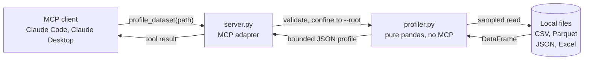

<!-- mcp-name: io.github.Ridadata/mcp-data-profiler -->

<div align="center">

# mcp-data-profiler

**Let an AI agent understand a dataset without reading it.**

An [MCP](https://modelcontextprotocol.io) server that turns a CSV, Parquet, JSON, or Excel file
into a compact structured profile — types, ranges, missing values, and likely data-quality
problems — instead of raw rows.

[](https://github.com/Ridadata/mcp-data-profiler/actions/workflows/ci.yml)
[](https://www.python.org/downloads/)
[](https://pypi.org/project/mcp-data-profiler/)
[](LICENSE)
[](https://modelcontextprotocol.io)

</div>

---

## Overview

To let an AI agent reason about a data file, you normally paste rows into the conversation.
That is expensive, truncates on anything large, and still leaves the model guessing at column
types and null rates.

This server answers the question directly. One tool call returns a structured summary that is
orders of magnitude smaller than the data and says more about it:

| Dataset | Raw file | Profile | Reduction | Time |
| --- | ---: | ---: | ---: | ---: |
| Google Play Store (2.3M rows × 24 cols) | 645 MB | 13 KB | **49,205×** | 1.9 s |
| SNCF punctuality (10,687 rows × 26 cols) | 2 MB | 13 KB | 189× | 0.2 s |
| Orders sample (5,000 rows × 6 cols) | 241 KB | 2.3 KB | 104× | 0.1 s |

The 645 MB file cannot go into a context window at any price. It is fully characterised here in
under two seconds.

## Demo

<!--
  Animated demo placeholder.
  Record with:  asciinema rec demo.cast  →  agg demo.cast docs/demo.gif
  Then replace the console block below with:  
-->

```console
# In Claude Code, Claude Desktop, or any MCP client:

you:  what's in orders.csv?
      └─ profile_dataset(path="orders.csv")

5,000 rows × 6 columns, no duplicate rows.

  order_id         str      5000 distinct    ⚠ looks like an ID
  customer_region  str      4 values         AMER/APAC/EMEA/LATAM, 1250 each
  amount_eur       float64  2.65–1369.65     median 683.65
  currency         str      1 value          ⚠ constant ("EUR")
  ordered_at       str      5000 distinct    ⚠ dates stored as text
  notes            float64  —                ⚠ entirely null
```

Three real problems surfaced before any analysis began: a column that never varies, one that is
entirely empty, and a date column that sorts as text — so `"2024-10-01" < "2024-9-01"` — silently
corrupting any time-based result.

## Features

- **Six data-quality flags** — constant, all-null, probable ID, mixed types, and numbers or dates
  stored as text.
- **Full column statistics** — dtype, null count and percentage, distinct count, sample values,
  quartiles for numerics, ranges for dates, frequent values for categories.
- **Bounded output** — the response stays small no matter how wide the input, and always reports
  what it truncated.
- **Honest sampling** — large files are sampled, but never silently; the true row count is always
  included.
- **Five formats, eleven extensions** — `.csv` `.tsv` `.txt` `.parquet` `.pq` `.json` `.jsonl`
  `.ndjson` `.xlsx` `.xlsm` `.xls`, plus `.gz` variants of the text formats.
- **Path confinement** — optional `--root` restricts profiling to a single directory.
- **Zero configuration** — no database, no index, no warm-up. Point it at a file.

## Architecture



All profiling logic lives in `profiler.py`, which imports nothing from MCP. It is unit-testable
without a protocol harness and usable as an ordinary Python library. `server.py` is only the
adapter.

## Installation

Requires **Python 3.10+**.

```bash
pip install mcp-data-profiler
```

<details>
<summary>Install the development version</summary>

```bash
pip install git+https://github.com/Ridadata/mcp-data-profiler.git
```

</details>

### Claude Code

```bash
claude mcp add data-profiler -- mcp-data-profiler
```

### Claude Desktop and other MCP clients

Add to your client's MCP configuration:

```json
{
  "mcpServers": {
    "data-profiler": {
      "command": "mcp-data-profiler"
    }
  }
}
```

To confine the server to one directory, add `"args": ["--root", "/path/to/your/data"]`.

## Usage

Once registered, ask in plain language:

- *"Profile `data/orders.csv`"*
- *"Which columns have missing values?"*
- *"Is this dataset clean enough to model?"*

### Tool reference

**`profile_dataset(path, sample_rows=50000, max_columns=100, top_k=5, sheet=None)`**

| Argument | Type | Default | Description |
| --- | --- | --- | --- |
| `path` | `str` | *required* | File to profile; `.gz` is decompressed transparently |
| `sample_rows` | `int \| null` | `50000` | Rows to read. `null` reads everything — exact, slower |
| `max_columns` | `int` | `100` | Cap on columns described, so wide tables stay small |
| `top_k` | `int` | `5` | Frequent values listed per categorical column |
| `sheet` | `str \| null` | first sheet | Which Excel sheet to profile, by name |

### Quality flags

| Flag | Meaning |
| --- | --- |
| `all_null` | Column is entirely empty |
| `constant` | Only ever one value — no signal |
| `high_cardinality_possible_id` | Nearly all values distinct; an identifier, not a feature |
| `numeric_stored_as_text` | Numbers typed as strings; comparisons and sorting will be wrong |
| `date_stored_as_text` | Dates typed as strings; same problem |
| `mixed_types` | One column holding several unrelated Python types |

### As a Python library

```python
from mcp_data_profiler import profile_dataset

profile = profile_dataset("data/orders.csv", sample_rows=None)
print(profile["shape"])          # {'rows_profiled': 5000, 'total_rows': 5000, 'columns': 6}
print(profile["duplicate_rows"]) # 0
```

## Example output

Verbatim output for the sample dataset produced by `python demo.py`, with three of the six
columns shown:

```json
{
  "file": { "name": "orders.csv", "format": "csv", "size_bytes": 247263 },
  "shape": { "rows_profiled": 5000, "total_rows": 5000, "columns": 6 },
  "sampled": false,
  "columns": [
    {
      "name": "order_id",
      "dtype": "str",
      "null_count": 0,
      "null_pct": 0.0,
      "unique_count": 5000,
      "sample_values": ["ORD-000000", "ORD-000001", "ORD-000002"],
      "flags": ["high_cardinality_possible_id"]
    },
    {
      "name": "amount_eur",
      "dtype": "float64",
      "null_count": 0,
      "null_pct": 0.0,
      "unique_count": 1368,
      "stats": {
        "min": 2.65, "max": 1369.65, "mean": 684.2364, "std": 395.254451,
        "q25": 341.65, "median": 683.65, "q75": 1025.65
      },
      "sample_values": [2.65, 39.65, 76.65]
    },
    {
      "name": "currency",
      "dtype": "str",
      "null_count": 0,
      "null_pct": 0.0,
      "unique_count": 1,
      "top_values": [{ "value": "EUR", "count": 5000 }],
      "sample_values": ["EUR", "EUR", "EUR"],
      "flags": ["constant"]
    }
  ],
  "duplicate_rows": 0
}
```

Note that `order_id` carries no `top_values`: for a near-unique column every count would be `1`,
so the list is omitted rather than padding the response with noise.

When a file is sampled, the profile also carries `"sampled": true`, the true `total_rows`, and a
`sampling_note` saying so.

## Design notes

**Bounded output.** The tool must cost less than the data it describes, so the response is capped
regardless of input width and long strings are truncated. Near-unique columns skip the
frequent-values list, since every count would be `1`.

**Honest sampling.** Large files are profiled from a sample, but the result always carries
`"sampled": true` alongside the true row count — a silently sampled statistic is a wrong
statistic. Row counts come from Parquet metadata or a raw newline scan, never a full parse into
memory.

**No silent wrong answers.** The same rule governs every default that could mislead. A workbook's
first sheet is often a title page, so Excel profiles always name the sheet used and list the
others rather than reporting an untouched sheet as a clean dataset. CSV delimiters are inferred by
testing candidates for a stable column count, which handles the semicolon files common in European
open data without the header-mangling that character-frequency sniffers cause. Compressed files are
decompressed before either check, since inspecting gzip bytes as text yields a plausible-looking
answer that is entirely wrong.

**Path safety.** `--root` confines profiling to one directory. Paths are canonicalised before the
check, so `..` and symlinks cannot escape it.

## Limitations

- **Read-only, local files.** No databases, no URLs, no writes.
- **Sampled by default.** Statistics reflect the first 50,000 rows unless you pass
  `sample_rows=null`.
- **Row-oriented.** No cross-column correlations, outlier detection, or plots.
- **pandas parsing rules apply.** The profile shows what pandas sees, which is what your own code
  will see. Notably `"NA"`, `"N/A"`, and `"None"` are read as *missing*, so a region column
  containing `"NA"` for North America will report nulls. That trap is surfaced, not hidden.
- **Nested JSON is not flattened.** Unhashable cells make the duplicate check inapplicable, and it
  is reported as `null`.
- **One Excel sheet per call.** The profile names the sheet read and lists the rest; pass `sheet`
  to switch.

## Development

```bash
git clone https://github.com/Ridadata/mcp-data-profiler.git
cd mcp-data-profiler
pip install -e ".[dev]"

pytest                                  # 40 tests
ruff check src tests demo.py            # lint
ruff format --check src tests demo.py   # formatting
python demo.py                          # profile a generated sample dataset
python demo.py path/to/your.csv         # profile your own files
```

CI runs the suite on Python 3.10–3.13 (Linux) plus Windows and macOS, and performs a real stdio
handshake against the built server to confirm it starts and advertises its tool.

### Releasing

Publishing to PyPI is automated via [Trusted Publishing][tp], so no API token is stored in this
repository. Publishing a GitHub Release triggers `.github/workflows/release.yml`, which builds the
distributions, verifies the built wheel actually installs and imports, and uploads it.

[tp]: https://docs.pypi.org/trusted-publishers/

Issues and pull requests are welcome.

## Roadmap

- [x] Publish to PyPI
- [x] Gzip-compressed inputs (`.csv.gz`, `.jsonl.gz`)
- [ ] List on the official MCP registry
- [ ] Cross-column correlation summary for numeric features
- [ ] Multi-sheet Excel profiling in a single call
- [ ] Remote sources (`s3://`, `https://`)

## License

[MIT](LICENSE) © Rida Aderkane
